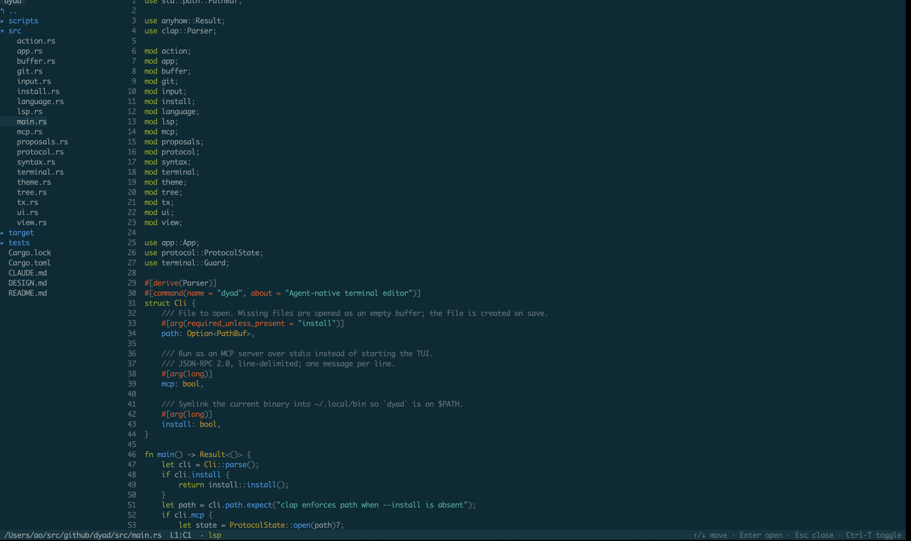
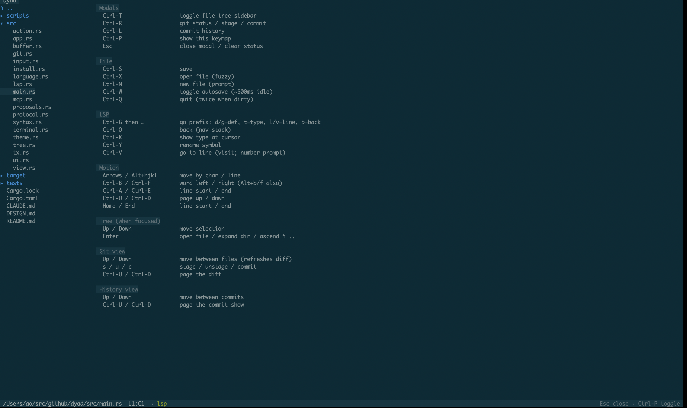
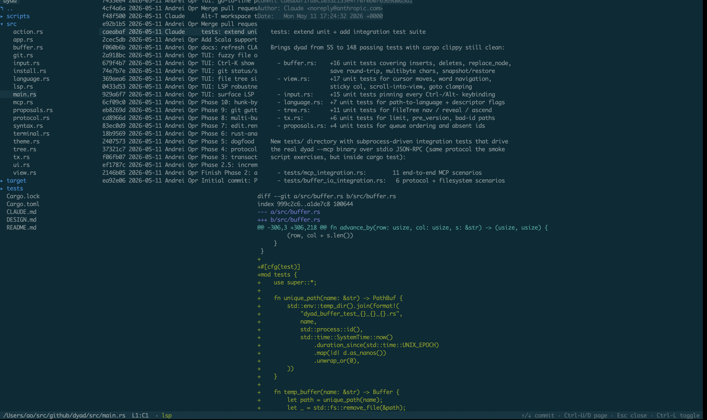
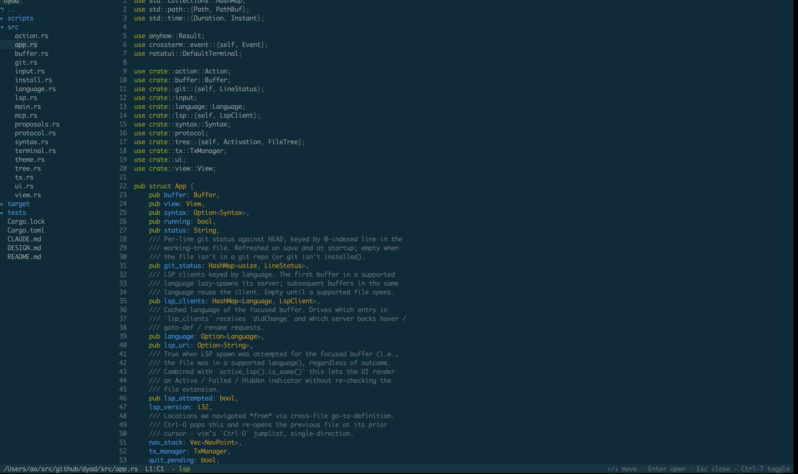

# dyad

An **agent-native terminal editor** in Rust. The editor is a runtime; humans
and agents are symmetric clients speaking the same protocol. There is no
privileged path for the UI vs. an agent.

This is not "an editor with AI bolted on." It's editor-as-runtime: the editor
owns buffers, AST, LSP state, and undo history, and exposes them over MCP so
an agent operates with the same primitives a human does.

The headline idea and the full protocol sketch live in [`DESIGN.md`](DESIGN.md).
Working notes for contributors (including Claude Code) are in [`CLAUDE.md`](CLAUDE.md).



## Status

Most of the phased build order in `DESIGN.md` is wired in: buffer/view,
Tree-sitter, transactions + intent, MCP stdio server, `rust-analyzer` LSP,
proposals, and the file/git/history overlays. Multi-client awareness is
partial — multiple buffers per `ProtocolState`, no concurrent TUI+MCP session
split yet.

Tested via `cargo test` (unit + integration) and `scripts/mcp-smoke.sh` for
the MCP protocol surface. The TUI is exercised manually.

## Quick start

```bash
cargo run -- path/to/file        # open in the TUI (created on save if missing)
cargo run -- path/to/file --mcp  # run as an MCP server over stdio (JSON-RPC 2.0, line-delimited)
cargo run -- --install           # symlink the release binary into ~/.local/bin
```

Build and lint:

```bash
cargo build
cargo test
cargo clippy --all-targets -- -D warnings
```

`cargo clippy -D warnings` must stay clean.

## Keybindings (TUI)

Non-modal — letter keys always insert. Press **Ctrl-P** in the editor to pop
up this same table as an overlay:



### Modals

| Key       | Action                                  |
| --------- | --------------------------------------- |
| Ctrl-T    | Toggle file tree sidebar                |
| Ctrl-R    | Git status / stage / commit overlay     |
| Ctrl-L    | Commit history overlay                  |
| Ctrl-P    | Show this keymap                        |
| Esc       | Close modal / clear status              |

### File

| Key       | Action                                  |
| --------- | --------------------------------------- |
| Ctrl-S    | Save                                    |
| Ctrl-X    | Open file (fuzzy)                       |
| Ctrl-N    | New file (prompt)                       |
| Ctrl-W    | Toggle autosave (~500 ms idle)          |
| Ctrl-Q    | Quit (press twice when dirty)           |

### LSP (Rust files, `rust-analyzer` on PATH)

| Key                   | Action                                              |
| --------------------- | --------------------------------------------------- |
| Ctrl-G then d/g       | Go to definition                                    |
| Ctrl-G then t         | Find type (workspace symbol search)                 |
| Ctrl-G then l/v       | Go to line                                          |
| Ctrl-G then b         | Back (navigation stack)                             |
| Ctrl-O                | Back (navigation stack) — direct                    |
| Ctrl-K                | Show type at cursor (hover)                         |
| Ctrl-Y                | Rename symbol                                       |
| Ctrl-V                | Go to line (prompt)                                 |
| F12, Ctrl-]           | Go to definition — direct escape hatch              |

LSP-backed features (diagnostics on the status bar, go-to-definition, hover,
rename, workspace symbol search) light up automatically when the file is
`.rs` and `rust-analyzer` is on `PATH`. They stay dark otherwise — the editor
falls back to plain text editing.

### Motion

| Key                  | Action                                  |
| -------------------- | --------------------------------------- |
| Arrows / Alt+h,j,k,l | Move by char / line                     |
| Ctrl-B / Ctrl-F      | Word left / right (Alt+b/f also)        |
| Ctrl-A / Ctrl-E      | Line start / end                        |
| Ctrl-U / Ctrl-D      | Page up / down                          |
| Home / End           | Line start / end                        |

### Tree (when focused)

| Key       | Action                                          |
| --------- | ----------------------------------------------- |
| Up / Down | Move selection                                  |
| Enter     | Open file / expand dir / ascend `..`            |

### Git view (Ctrl-R)

| Key             | Action                                   |
| --------------- | ---------------------------------------- |
| Up / Down       | Move between files (refreshes the diff)  |
| s / u / c       | Stage / unstage / commit                 |
| Ctrl-U / Ctrl-D | Page the diff                            |

### History view (Ctrl-L)

| Key             | Action                                   |
| --------------- | ---------------------------------------- |
| Up / Down       | Move between commits                     |
| Ctrl-U / Ctrl-D | Page the commit show                     |



## MCP

With `--mcp`, dyad speaks JSON-RPC 2.0 line-delimited over stdio. A smoke
script lives at [`scripts/mcp-smoke.sh`](scripts/mcp-smoke.sh). The protocol
verbs mirror the names in `DESIGN.md` §Edits and §Buffers & views — `Buffer`
method names track them deliberately so the MCP layer is a thin wrapper.

## Architecture (one screen)

```
KeyEvent -> input::map -> Action -> App::apply -> TxManager wrap -> Buffer/View mutations -> ui::render
```



- `buffer.rs` — owns the rope, path, version, dirty flag, pending edits.
  Every mutation bumps `version` (optimistic concurrency for MCP writers).
- `view.rs` — cursor + viewport. Borrows `Buffer`; never owns it. Multi-view
  per buffer is a non-event by construction.
- `app.rs` — single TUI mutation funnel (`App::apply(Action)`). Transactions
  wrap this; nothing else mutates state.
- `action.rs` — flat enum, no logic. Keymap and MCP handlers construct the
  same actions.
- `input.rs` / `ui.rs` / `terminal.rs` — keymap, render, and a RAII terminal
  guard that restores on panic.
- `mcp.rs` / `protocol.rs` / `tx.rs` / `syntax.rs` / `lsp.rs` / `git.rs` /
  `proposals.rs` / `tree.rs` — agent-facing surface and the integrations
  behind it.

See `DESIGN.md` for the rationale behind each boundary.
